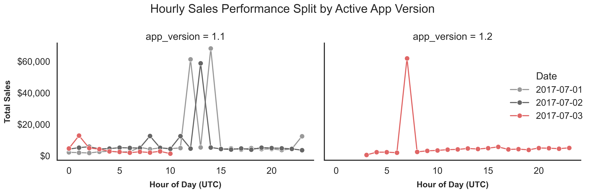

# Initial Data Impressions

This document summarizes preliminary observations from the exploratory notebook. These notes are not intended to answer the challenge questions directly. Instead, they capture what I noticed while validating and exploring the dataset before moving into explanation, URL analysis, and forecasting.

The goal of this stage was to understand the structure and behavior of the data, identify potential data quality concerns, and determine which areas require deeper investigation.

## Scope of This Markdown File

After acquiring the raw transaction logs, several items stood out as potentially important for deeper analysis:

- Timestamps include timezone information and need to be normalized before comparing daily totals.
- July 3 has lower total sales than the prior available days, despite having more transactions than July 2.
- A small number of very large transactions exist, which may skew daily averages and total sales comparisons.
- July 3 includes an app version change, with records from both version 1.1 and version 1.2.
- A number of negative checkout amounts appear, and these occur only on July 3.

Generated charts are saved in `outputs/figures/`, and generated summary tables are saved in `outputs/tables/`.

---

## 1. Data Loading and Timestamp Normalization

The transaction logs were loaded from the public S3 bucket described in the challenge instructions. Each file contains transaction-level records with timestamps, website IDs, customer IDs, app versions, checkout amounts, and URLs.

During initial loading, the timestamp field contained timezone-aware values with mixed timezone information. To make records comparable across files and dates, I normalized all timestamps to Coordinated Universal Time (UTC).

This matters because the challenge involves daily sales totals. If transactions are grouped into days without a consistent timezone convention, records near date boundaries could be assigned to different days depending on the parsing or reporting method used.

**Initial takeaway:** timezone handling should be explicit. Inconsistent timestamp normalization could lead to misaligned daily comparisons.

---

## 2. General Overview

Initial daily summaries show that July 3 has lower total sales than the prior available days, even though it has slightly more transactions than July 2. The average order value is also lower on July 3, while the median order value is the same across all three days. This suggests the difference in daily sales may be influenced by skew, outliers, product mix, or unusual transaction behavior rather than a simple decrease in transaction volume.

Data summary:

| Date | Transactions | Total Sales | Avg Order Value | Median Order Value | Min Order | Max Order | Unique Customers | App Versions |
|:---|---:|---:|---:|---:|---:|---:|---:|---:|
| 2017-07-01 | 9,903 | $223,515 | $22.57 | $6.00 | $0 | $55,084 | 7,372 | 1 |
| 2017-07-02 | 11,537 | $183,752 | $15.93 | $6.00 | $3 | $55,002 | 8,168 | 1 |
| 2017-07-03 | 11,748 | $181,583 | $15.46 | $6.00 | -$12 | $60,000 | 8,227 | 2 |

### Daily Total Sales

---

### Daily Total Sales by Website

---

### Daily Transaction Count

---

### Daily Average Order Value

---

### Daily Median Order Value

**Initial takeaway:** daily total sales should not be interpreted by itself. It needs to be paired with transaction volume, order-value metrics, and checks for unusual transactions or system-level changes.

---

## 3. Sales Patterns Include Skew and Hourly Variation 

The checkout amount field contains a small number of very large transactions. These outliers matter because they can strongly affect daily total sales and average order value, especially when comparing only a few days of data.

This is one reason I avoid relying only on daily totals or average order value. The median order value is stable across all three days, while the average varies more noticeably, suggesting that the distribution of checkout amounts is skewed.

To avoid letting a few extreme values dominate the visual analysis, I inspect transaction amount distributions separately from the aggregate daily sales views.

### Hourly Sales by Day

---

### Checkout Amount Distribution

**Initial takeaway:** daily total sales should not be interpreted by itself. A small number of very large transactions may meaningfully affect total sales and average order value, so median order value and transaction-level distributions are important context.

---

## 4. App Version Change on July 3

The exploratory analysis also reviews behavior by app version. This is noteworthy because July 3 is the only day in the available data with records from both app version `1.1` and app version `1.2`.

At this stage, I am not assuming the app version change caused any difference in sales behavior. However, because the version change occurs on the same day that total sales appear lower, it is useful context to carry forward. Comparing transaction volume, checkout amounts, and hourly activity by app version may help determine whether the July 3 patterns are consistent across versions or differ between them.

### Hourly Transactions by Date and App Version

**Initial takeaway:** July 3 includes an app version transition, which may be relevant context for later analysis. This does not imply the update caused a problem, but app-version-level behavior should be considered when interpreting July 3 sales patterns.

---

## 5. Negative Checkout Amounts Appear Only on July 3

One notable transaction-level anomaly is that negative checkout amounts appear only on July 3. Every negative checkout amount observed is exactly `-12`.

This pattern is worth investigating because:

- the negative values appear only on July 3,
- the amount is always exactly `-12`,
- the records occur across both website IDs and persist across the app version transition, appearing in both `1.1` and `1.2`, and the consistency of the amount makes ordinary returns or refunds less obvious as the sole explanation.

A negative checkout amount could represent a refund, return, chargeback, coupon, adjustment, or correction. However, the repeated `-12` value suggests the possibility of a more systematic explanation, such as a product price entered incorrectly, a discount or promotion being logged as a transaction, or another application/data logging behavior.

At this stage, I am not removing these transactions from the data. Instead, I am flagging them as records that require additional context before deciding whether they should be included in sales totals, excluded, or reclassified.

Relevant output table of negative checkout amounts:

| timestamp                 | date       |   hour |   website_id |   customer_id |   app_version |   checkout_amount | url                                                              | source_file    |
|:--------------------------|:-----------|-------:|-------------:|--------------:|--------------:|------------------:|:-----------------------------------------------------------------|:---------------|
| 2017-07-03 00:27:19+00:00 | 2017-07-03 |      0 |          124 |         10678 |           1.1 |               -12 | http://xyz.com/checkout?European+Grape=1&Round+Kumquat=1         | 2017-07-03.csv |
| 2017-07-03 08:20:25+00:00 | 2017-07-03 |      8 |          124 |         10113 |           1.1 |               -12 | http://xyz.com/checkout?Bignay=2                                 | 2017-07-03.csv |
| 2017-07-03 01:28:04+00:00 | 2017-07-03 |      1 |          124 |         10186 |           1.1 |               -12 | http://xyz.com/checkout?Ume=1&Natal+Orange=1                     | 2017-07-03.csv |
| 2017-07-03 10:01:08+00:00 | 2017-07-03 |     10 |          123 |         10769 |           1.1 |               -12 | http://www.example.com/store/?Round+Kumquat=1&European+Grape=1   | 2017-07-03.csv |
| 2017-07-03 03:10:05+00:00 | 2017-07-03 |      3 |          124 |         10152 |           1.1 |               -12 | http://xyz.com/checkout?Round+Kumquat=1&Black%2FWhite+Pepper=1   | 2017-07-03.csv |
| 2017-07-03 11:15:33+00:00 | 2017-07-03 |     11 |          124 |         10906 |           1.2 |               -12 | http://xyz.com/checkout?Round+Kumquat=1&Black%2FWhite+Pepper=1   | 2017-07-03.csv |
| 2017-07-03 11:18:54+00:00 | 2017-07-03 |     11 |          124 |         10187 |           1.2 |               -12 | http://xyz.com/checkout?Round+Kumquat=1&Ylang-ylang=1            | 2017-07-03.csv |
| 2017-07-03 04:37:32+00:00 | 2017-07-03 |      4 |          123 |         10814 |           1.2 |               -12 | http://store.example.com/?Round+Kumquat=1&European+Grape=1       | 2017-07-03.csv |
| 2017-07-03 11:44:53+00:00 | 2017-07-03 |     11 |          124 |         10098 |           1.2 |               -12 | http://xyz.com/checkout?Natal+Orange=2                           | 2017-07-03.csv |
| 2017-07-03 05:10:47+00:00 | 2017-07-03 |      5 |          123 |         10462 |           1.2 |               -12 | http://store.example.com/?Hazelnut=1&Mabolo=1                    | 2017-07-03.csv |
| 2017-07-03 05:21:34+00:00 | 2017-07-03 |      5 |          123 |         10586 |           1.2 |               -12 | http://store.example.com/?Round+Kumquat=1&European+Grape=1       | 2017-07-03.csv |
| 2017-07-03 12:33:22+00:00 | 2017-07-03 |     12 |          124 |         10921 |           1.2 |               -12 | http://xyz.com/checkout?Bignay=2                                 | 2017-07-03.csv |
| 2017-07-03 05:36:29+00:00 | 2017-07-03 |      5 |          124 |         10064 |           1.2 |               -12 | http://xyz.com/checkout?Bignay=2                                 | 2017-07-03.csv |
| 2017-07-03 05:41:52+00:00 | 2017-07-03 |      5 |          123 |         10885 |           1.2 |               -12 | http://store.example.com/?Round+Kumquat=1&Ylang-ylang=1          | 2017-07-03.csv |
| 2017-07-03 06:30:39+00:00 | 2017-07-03 |      6 |          124 |         10580 |           1.2 |               -12 | http://xyz.com/checkout?Round+Kumquat=1&Black%2FWhite+Pepper=1   | 2017-07-03.csv |
| 2017-07-03 07:49:50+00:00 | 2017-07-03 |      7 |          124 |         10998 |           1.2 |               -12 | http://xyz.com/checkout?European+Grape=1&Round+Kumquat=1         | 2017-07-03.csv |
| 2017-07-03 14:57:28+00:00 | 2017-07-03 |     14 |          123 |         10177 |           1.2 |               -12 | http://store.example.com/?Round+Kumquat=1&Black%2FWhite+Pepper=1 | 2017-07-03.csv |

**Initial takeaway:** The repeated `-12` transactions are unlikely to be random noise. They should be isolated before deciding whether they represent valid promotional adjustments, returns/corrections, a pricing/catalog issue, or a logging artifact.

---

## 6. Initial Items to Carry Forward

This document is intended only as a record of the patterns and anomalies that stood out during preliminary data exploration. I have not yet attempted to answer the challenge questions directly.

The items that seem most worth remembering are:

- **The negative checkout amounts are unusual.**  
  They occur only on July 3, are always exactly `-12`, and appear across website IDs and app versions.

- **July 3 includes an app version change.**  
  App version `1.2` first appears on July 3, making the version transition useful context for later interpretation.

- **The checkout amount distribution is skewed.**  
  A few very large transactions may materially affect daily totals and average order value.

- **Timezone handling matters.**  
  Daily comparisons should use a consistent timestamp normalization/date-boundary convention.

---