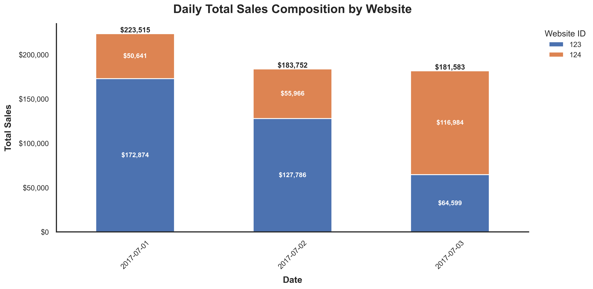
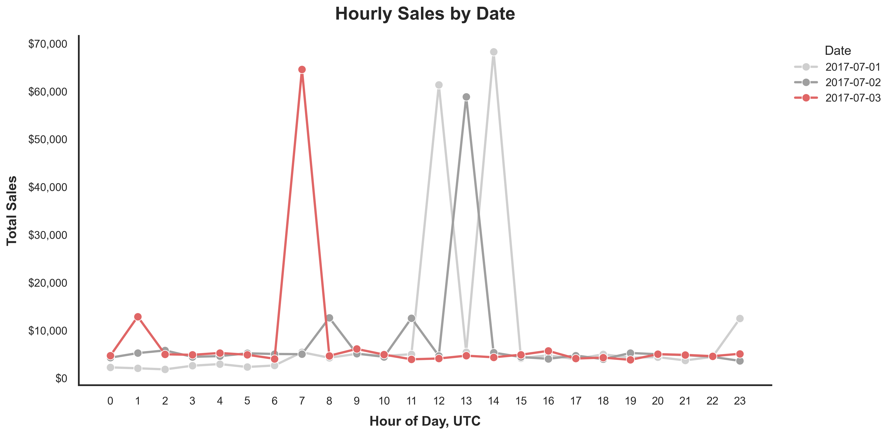
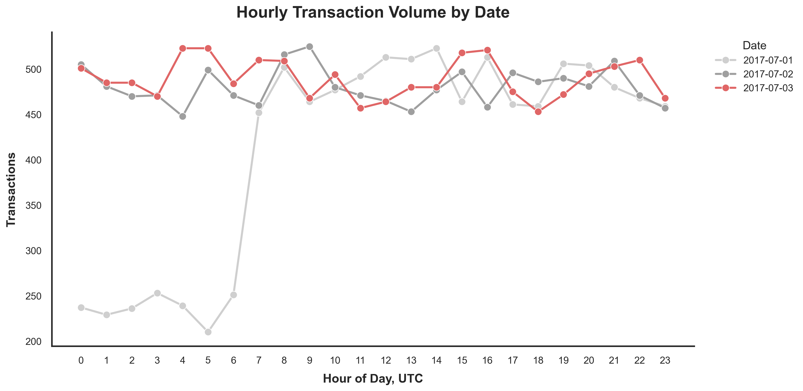

# Exploratory Data Analysis Summary

This markdown file summarizes the main patterns and data-quality questions from the exploratory notebook. It is not intended to answer the full challenge questions directly. Instead, it highlights what stood out during the initial data review and points to the tables and figures that support those observations.

Generated charts are saved in `outputs/figures/`, and generated summary tables are saved in `outputs/tables/`.

---

## Summary of Initial Exploration

This initial exploration helped identify a few patterns and data-quality questions that are useful context for the requested analysis:

- **Timestamps do not appear to be normalized.** When reporting daily summaries, it is important that all transactions share a common timezone baseline.

- Daily sales, average checkout values, median checkout values, and transaction counts seem **reasonably consistent** across the available dates.

- When looking at daily sales by website ID, there is an interesting pattern where **website 123 decreases in sales while website 124 increases in sales**. With only three days of data, it is difficult to know whether this is meaningful. However, it may be worth noting, especially if either website 123 or website 124 had any changes that could affect sales.

- **There are odd negative values.** These values are all exactly `-$12.00`. They only appear on July 3, but they appear across both websites and both app versions. They also do not immediately seem tied to a specific item from the URL. This makes a bug tied only to the app upgrade, a specific website, or a specific item seem less likely.

- **There are very large checkout amount outliers.** When inspecting the 10 largest checkout amounts, there is a noticeable jump from hundreds of dollars (`$573.00`) to over eight thousand dollars (`$8,219.00`). The largest checkout amount is notably `$60,000.00`. This data point is worth flagging because there are a few possible indicators that it may be problematic: the amount is exactly `$60,000.00`, the URL contains `error=True`, and it appears to be the first major outlier after the app version was updated. These observations do not prove that there is an issue with the transaction, but they do suggest that it should be handled with care.

---

## Supporting Notes and Outputs

### 1. Timestamp normalization matters

The raw timestamps contain timezone information, so daily comparisons should use a consistent timezone convention. In the exploratory notebook, timestamps were normalized to UTC before creating date-level summaries.

This matters because the requested analysis relies on daily sales totals. If transactions near a date boundary are grouped using inconsistent timezone assumptions, the daily totals could shift slightly.

---

### 2. Daily sales and transaction patterns are mostly consistent

The daily summary provides a quick baseline for comparing the available dates.

| Date | Transactions | Total Sales | Avg Checkout Value | Median Checkout Value | Min Checkout | Max Checkout | Unique Customers | App Versions |
|:---|---:|---:|---:|---:|---:|---:|---:|---:|
| 2017-07-01 | 9,903 | $223,515 | $22.57 | $6.00 | $0 | $55,084 | 7,372 | 1 |
| 2017-07-02 | 11,537 | $183,752 | $15.93 | $6.00 | $3 | $55,002 | 8,168 | 1 |
| 2017-07-03 | 11,748 | $181,583 | $15.46 | $6.00 | -$12 | $60,000 | 8,227 | 2 |

The median checkout value is stable across all three days, while the average checkout value varies more. This suggests that the checkout amount distribution is skewed and that large transactions may have a noticeable effect on daily totals.

**Relevant table:** `outputs/tables/daily_summary.csv`

#### Daily Total Sales

#### Daily Transaction Count

#### Daily Average Checkout Value

#### Daily Median Checkout Value

---

### 3. Website-level sales show a pattern worth noting

Splitting daily sales by website ID shows that the two websites do not move in the same direction. Website `123` decreases in sales, while website `124` increases in sales.

With only three days of data, I would not treat this as a clear trend. However, it is useful context. If either website had deployment, marketing, routing, product, pricing, or tracking changes during this period, that could help explain the difference.

#### Daily Total Sales by Website

---

### 4. Hourly patterns add context, but do not fully explain the issue by themselves

Hourly sales and transaction volume are useful checks because they can show whether a daily change is spread throughout the day or concentrated around a specific time window.

In this exploration, hourly views are treated as context rather than a final explanation. The data spans only a few days, so I am cautious about reading too much into hour-by-hour differences without additional dates for comparison.

**Relevant table:** `outputs/tables/hourly_daily_summary.csv`

#### Hourly Sales by Date

#### Hourly Transaction Volume by Date

---

### 5. Negative checkout values should be isolated before deciding how to treat them

There are 17 negative checkout values in the data, and all of them are exactly `-$12.00`. They only appear on July 3, but they appear across both website IDs and both app versions.

This makes the pattern unusual. It does not immediately look like a simple issue tied to only one website, only one app version, or one obvious URL item. These could still be valid transactions, such as refunds, returns, reversals, corrections, discounts, or another business process. However, because the value is repeated exactly, I would avoid silently including or excluding them without additional context.

**Relevant table:** `outputs/tables/negative_checkout_transactions.csv`

| timestamp | date | hour | website_id | customer_id | app_version | checkout_amount | url | source_file |
|:---|:---|---:|---:|---:|---:|---:|:---|:---|
| 2017-07-03 00:27:19+00:00 | 2017-07-03 | 0 | 124 | 10678 | 1.1 | -12 | `http://xyz.com/checkout?European+Grape=1&Round+Kumquat=1` | 2017-07-03.csv |
| 2017-07-03 08:20:25+00:00 | 2017-07-03 | 8 | 124 | 10113 | 1.1 | -12 | `http://xyz.com/checkout?Bignay=2` | 2017-07-03.csv |
| 2017-07-03 10:01:08+00:00 | 2017-07-03 | 10 | 123 | 10769 | 1.1 | -12 | `http://www.example.com/store/?Round+Kumquat=1&European+Grape=1` | 2017-07-03.csv |
| 2017-07-03 11:15:33+00:00 | 2017-07-03 | 11 | 124 | 10906 | 1.2 | -12 | `http://xyz.com/checkout?Round+Kumquat=1&Black%2FWhite+Pepper=1` | 2017-07-03.csv |
| 2017-07-03 04:37:32+00:00 | 2017-07-03 | 4 | 123 | 10814 | 1.2 | -12 | `http://store.example.com/?Round+Kumquat=1&European+Grape=1` | 2017-07-03.csv |
| 2017-07-03 12:33:22+00:00 | 2017-07-03 | 12 | 124 | 10921 | 1.2 | -12 | `http://xyz.com/checkout?Bignay=2` | 2017-07-03.csv |
| 2017-07-03 14:57:28+00:00 | 2017-07-03 | 14 | 123 | 10177 | 1.2 | -12 | `http://store.example.com/?Round+Kumquat=1&Black%2FWhite+Pepper=1` | 2017-07-03.csv |

The table above shows a shortened sample. The full set of negative transactions is saved in the output table.

---

### 6. Large checkout outliers may strongly affect totals and averages

The checkout amount distribution includes a small number of very large transactions. This matters because daily total sales and average checkout value can be heavily influenced by a few extreme values, especially with only three days of data.

The largest checkout amount is `$60,000.00`. I would flag this transaction for review because the value is exactly `$60,000.00`, the URL contains `error=True`, and it appears after the app version update. That does not prove the transaction is invalid, but it does make the record worth treating carefully.

**Relevant tables:**

- `outputs/tables/checkout_amount_anomaly_summary.csv`
- `outputs/tables/top_10_largest_checkout_values.csv`

#### Checkout Amount Distribution

---

