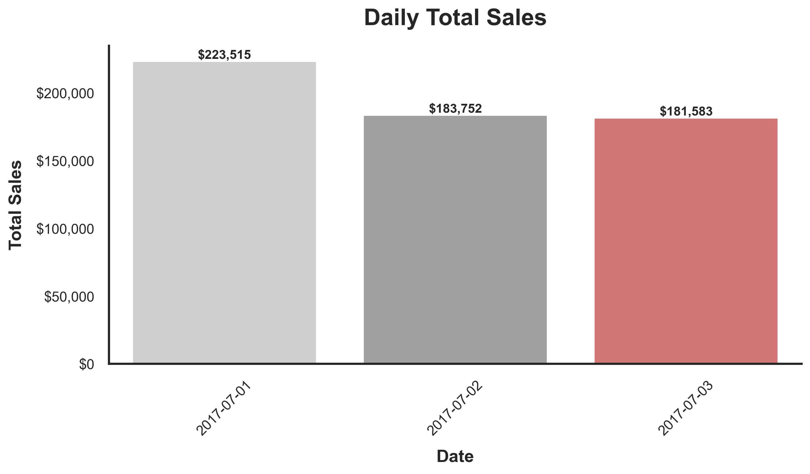
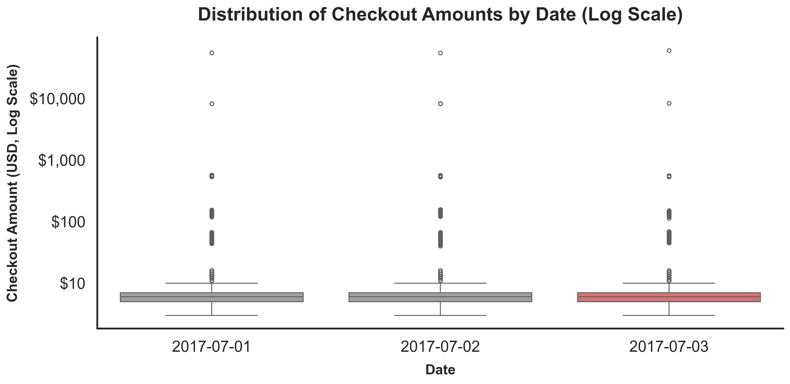
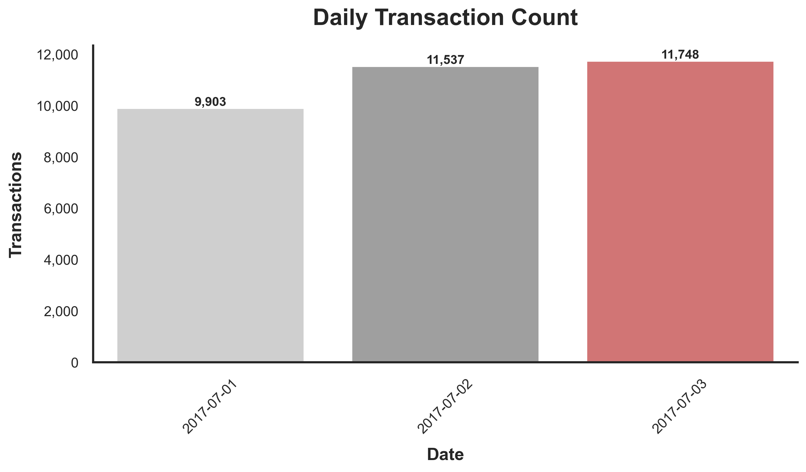
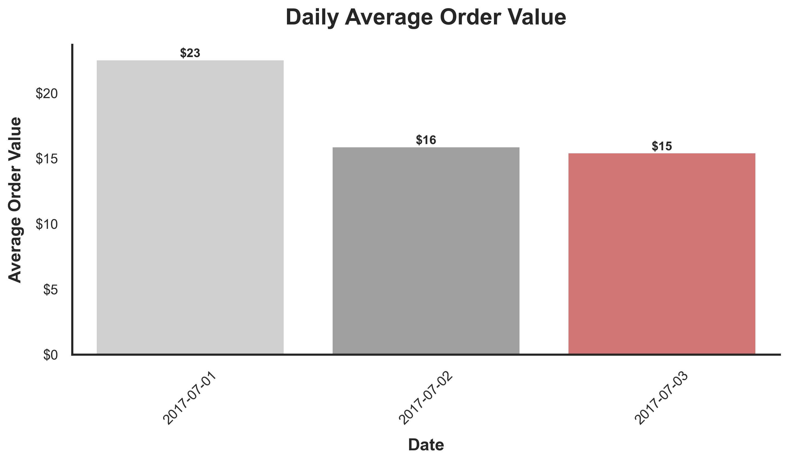
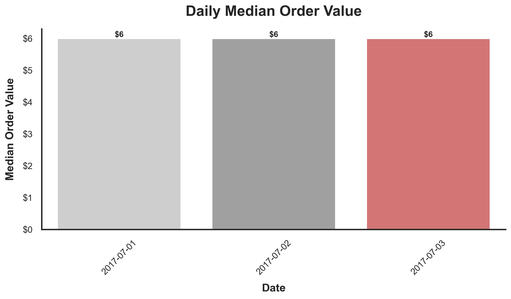
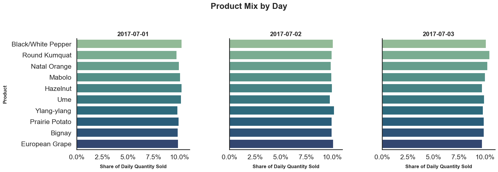
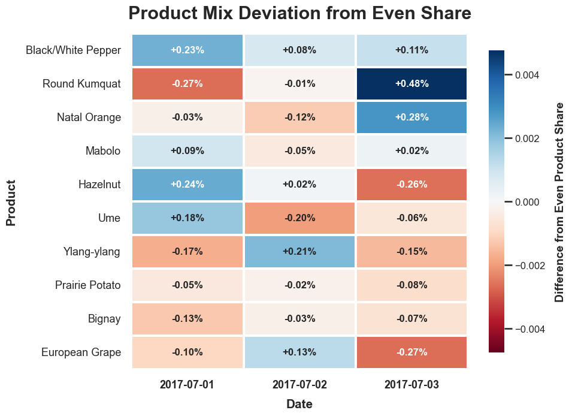

# Postie Data Challenge 

This document summarizes the main findings from the analysis notebook without including the underlying code. The goal is to make the results easy to skim while preserving the key evidence, assumptions, and recommendations.

The notebook remains the reproducible source of truth. This file is intended as a reader-facing summary of what I found and how I interpreted it.

---

## Summary

The originally reported July 3 sales value of **$164,065** appears low because it matches a source-file or unnormalized date grouping rather than a UTC-normalized transaction-date grouping. After normalizing timestamps to UTC, July 3 sales are **$181,583**, which is only **$2,169 lower than July 2**.

The data does not suggest a major collapse in transaction activity on July 3. In fact, transaction count is slightly higher on July 3 than July 2. The more important findings are around date handling, transaction anomalies, URL/cart parsing, and metric selection.


| Finding | Why it matters |
|:---|:---|
| **Date-boundary handling changes the July 3 total** | The reported value matches unnormalized/source-file grouping, while UTC-normalized transaction dates produce a materially higher July 3 total. |
| **July 3 has repeated `-12` checkout amounts** | These occur only on July 3 and appear across websites and app versions, making them worth investigating before final revenue reporting. |
| **At least one malformed/error-like URL is tied to an extreme checkout amount** | URL-derived product and price analysis should include anomaly handling. |
| **Product prices appear inferable for normal transactions** | Single-product carts show stable prices across websites, after excluding anomalous rows. |
| **Average order value is not enough** | Checkout amounts are skewed by large transactions, so median, transaction count, outlier counts, and product/cart metrics should also be monitored. |
| **July 4 forecast should be simple and cautious** | Only three days of data are available, and July 4 is a holiday, so complex modeling would create false precision. |

---

## Data Context

The cleaned dataset contains transaction-level records from **July 1 through July 3, 2017**. Each record includes a timestamp, website ID, customer ID, app version, checkout amount, and a URL containing product/count parameters.

After cleaning, the analysis uses UTC-normalized timestamps so that transaction dates are compared consistently across files.

| Metric | Value |
|:---|---:|
| Rows | 33,188 |
| Total sales | $588,850 |
| Date range | 2017-07-01 to 2017-07-03 |
| Missing timestamps after cleaning | 0 |
| Missing checkout amounts after cleaning | 0 |

---

<br><br>

<div style="background-color:#fff3cd; padding:16px; border-left:6px solid #f0ad4e; border-radius:6px;">

## 1. Why was the reported July 3 sales value lower than the previous day?
</div>
<br><br>

The analyst reported July 3 sales of **$164,065**. When I compute July 3 sales using UTC-normalized transaction dates, I get **$181,583**.

This means the reported value is lower than the UTC-normalized total by **$17,518**. The difference appears to come primarily from how transactions are assigned to dates.

| Date | Total Sales | Transactions | Average Order Value | Median Order Value |
|:---|---:|---:|---:|---:|
| 2017-07-01 | $223,515 | 9,903 | $22.57 | $6.00 |
| 2017-07-02 | $183,752 | 11,537 | $15.93 | $6.00 |
| 2017-07-03 | $181,583 | 11,748 | $15.46 | $6.00 |

Using the normalized dates, July 3 is only **$2,169 lower than July 2**, or about **1.2%**. Transaction count is actually higher on July 3.

### Supporting figure

<p align="center">
  
</p>

### Note on negative checkout amounts

July 3 also contains **17 negative checkout amounts**, each exactly **`-12`**, for a total contribution of **-$204**.

These negative transactions do not explain the full reported discrepancy, but they are suspicious because they occur only on July 3 and have the same repeated value. They should be investigated before final revenue reporting.

### Note on one malformed URL / large transaction

There is also at least one transaction with a malformed or error-like URL associated with a very large checkout amount. I do **not** remove this transaction from the July 3 sales total in this analysis.

My current assumption is that the checkout amount may still represent a valid transaction, even if the URL did not serialize cleanly. It is also possible that the unusually large order itself contributed to the malformed URL behavior. Because I do not have enough evidence to treat the transaction as invalid, I leave it in the sales total and flag it as something to revisit.

This matters because removing or reclassifying a very large transaction would materially change daily sales. For now, I treat it as a valid transaction with a data-quality concern attached, rather than as a transaction that should be excluded automatically.

### Interpretation

July 3 sales are slightly lower than July 2, but not nearly as low as the originally reported value suggests. The evidence points more toward **date-boundary handling and transaction-level anomalies** than a major drop in customer activity.

---
<br><br>

<div style="background-color:#fff3cd; padding:16px; border-left:6px solid #f0ad4e; border-radius:6px;">

## 2. Is average sales value the right metric?
</div>
<br><br>
Average sales value is useful, but it should not be used alone.

The checkout amount distribution is skewed, with a small number of very large transactions. This means the average can move substantially even when the typical checkout remains stable. In this dataset, the median checkout amount is **$6.00 on all three days**, while the average order value varies more noticeably.

### Recommended metrics

| Metric | Why it is useful |
|:---|:---|
| **Total sales** | Measures overall revenue. |
| **Transaction count** | Shows customer/order activity independent of order size. |
| **Average order value** | Useful for revenue per transaction, but sensitive to outliers. |
| **Median order value** | Better reflects a typical transaction when the distribution is skewed. |
| **High-value transaction count** | Helps explain large changes in daily sales or average order value. |
| **Negative transaction count/value** | Flags refunds, adjustments, discounts, or possible logging/pricing issues. |
| **Website-level breakdowns** | Helps identify whether behavior is isolated to one website. |
| **App-version breakdowns** | Useful because July 3 includes an app version transition. |
| **Cart size and product mix** | Helps explain whether sales changes are driven by what customers bought. |


### Checkout Amount Distribution



---

### Daily Total Sales


---


### Daily Transaction Count



---

### Daily Average Order Value



---

### Daily Median Order Value



### Interpretation

Average order value is not wrong, but it is not stable enough to use as the primary health metric by itself. It should be reported alongside total sales, transaction count, median order value, outlier counts, anomaly counts, and website/app-version breakdowns.

---

<br><br>
<div style="background-color:#fff3cd; padding:16px; border-left:6px solid #f0ad4e; border-radius:6px;">

## 3. What information can be extracted from the URLs? Can product prices be inferred?
</div>
<br><br>

The URLs are one of the most useful fields in the dataset. The query strings encode cart contents as product/count pairs, which allows each transaction to be decomposed into products and quantities.

From the URLs, I can extract:

- product names,
- product quantities,
- number of distinct products in the cart,
- total item quantity,
- product combinations,
- website/domain and checkout path patterns,
- malformed or unusual URL/query behavior.

### Important caveat: malformed URL behavior

Not every URL should be treated as a reliable cart. At least one malformed/error-like URL is associated with an extreme checkout amount. This matters because product-price inference assumes that the URL accurately represents the cart.

Rows with malformed URLs, negative checkout amounts, or extreme checkout values should be flagged before using URL-derived prices as authoritative.

### Inferred product prices

For normal single-product transactions, product prices can be inferred directly by dividing checkout amount by quantity. These prices appear consistent across both websites.

| Product | Inferred Unit Price |
|:---|---:|
| Bignay | $6 |
| Black/White Pepper | $5 |
| European Grape | $5 |
| Hazelnut | $4 |
| Mabolo | $8 |
| Natal Orange | $6 |
| Prairie Potato | $3 |
| Round Kumquat | $7 |
| Ume | $6 |
| Ylang-ylang | $5 |

The main exception is a Bignay transaction on website `124` with an observed unit price of **$60,000**. Because the median Bignay price is still **$6**, and because that row appears tied to malformed/error-like URL behavior, I would treat it as an anomaly rather than a true product price.

### Interpretation

Product prices can be inferred for normal product rows. However, not every URL should be trusted without validation. URL parsing is valuable, but it should be paired with anomaly checks.

---

<br><br>
<div style="background-color:#fff3cd; padding:16px; border-left:6px solid #f0ad4e; border-radius:6px;">

## 4. What purchasing combinations, events, or metrics are worth reporting?
</div>
<br><br>

The most important findings are not only purchasing combinations. They are a mix of purchasing behavior, system behavior, and data-quality signals.

### System events and data behaviors worth reporting

| Finding | Why it matters |
|:---|:---|
| **Date-boundary/source-file mismatch** | Explains why the reported July 3 value differs from the UTC-normalized total. |
| **Repeated `-12` checkout amounts** | Occur only on July 3 and may indicate a systematic adjustment, pricing issue, promotion, or logging artifact. |
| **Malformed/error-like URL tied to an extreme checkout amount** | Suggests that product and price inference need anomaly handling. |
| **App version transition on July 3** | July 3 includes both app version `1.1` and `1.2`, so version behavior should be considered when diagnosing that day. |
| **Skewed checkout distribution** | A small number of large transactions can materially affect sales totals and averages. |

### Product mix

The product mix appears fairly balanced across days. There are small shifts in individual products, but no single product appears to dominate July 3 in a way that would clearly explain the lower sales total.

<p align="center">
  
</p>

<p align="center">
  
</p>

This suggests July 3’s sales pattern is more likely related to date handling, order-value distribution, anomalies, or system behavior than to a major shift in what products customers purchased.

### Cart size

Most transactions appear to be simple carts, often containing a single product. This supports the reliability of single-product price inference.

Larger multi-product or high-quantity carts are less common, but they can contribute disproportionately to revenue and average order value. These should be monitored separately from typical carts.

### Interpretation

For reporting, I would include daily sales and transaction metrics, but also add anomaly counts, cart-size distribution, product mix, high-value transaction monitoring, website/app-version breakdowns, and URL parsing validation.

---

<br><br>
<div style="background-color:#fff3cd; padding:16px; border-left:6px solid #f0ad4e; border-radius:6px;">

## 5. July 4 Sales Prediction
</div>
<br><br>

I predict July 4 total sales will be approximately **$182,500**.

I would treat this as a **low-confidence forecast**, with a reasonable uncertainty range of roughly:

```text
$165,000 to $205,000
```

This is intentionally not a model-heavy forecast. With only three days of available data, a complex model would likely create a false sense of precision.

### Forecasting approach

The prediction estimates total checkout sales for **2017-07-04**, using cleaned and UTC-normalized transaction data from July 1 through July 3.

The baselines considered are:

| Method | Interpretation |
|:---|:---|
| **Prior-day forecast** | July 4 looks like July 3. |
| **Recent 2-day average** | July 4 looks like the average of July 2 and July 3. |
| **Transaction-based forecast** | Estimate transactions and multiply by recent average order value. |
| **Negative-value adjustment scenario** | Consider whether July 3’s repeated `-12` transactions should be adjusted. |

### Assumptions

This forecast assumes:

- UTC-normalized transaction date is the correct date definition.
- July 4 behavior is broadly similar to July 2 and July 3.
- No major system outage occurs on July 4.
- No major app-version effect occurs on July 4.
- The repeated `-12` transactions on July 3 are not large enough to materially change the forecast.
- Large outlier purchases may occur, but cannot be predicted reliably from the available history.
- July 4 being a U.S. holiday is an important uncertainty factor, but the available dataset does not provide enough history to estimate a holiday effect directly.

### Interpretation

The available data supports a prediction that July 4 will likely be in the same general range as July 2 and July 3. However, the exact value is uncertain because the dataset is short, July 4 may behave differently as a holiday, and the transaction data contains outliers and anomalies.

---

<br><br>
<div style="background-color:#fff3cd; padding:16px; border-left:6px solid #f0ad4e; border-radius:6px;">

## 6. What additional data would improve the prediction?
</div>
<br><br>

Yes. The forecast would be substantially better with more historical sales data, clearer date/reporting rules, product metadata, promotion/refund information, and system/app release context.

| Additional data or access | Why it would help |
|:---|:---|
| **More historical transaction data** | Needed to estimate normal daily variation, weekday patterns, holiday effects, and seasonality. |
| **Prior July 4 / holiday sales history** | July 4 may not behave like a normal day, but the current dataset cannot estimate that effect. |
| **Confirmed timezone and reporting rules** | Daily totals depend on how transaction dates are defined. |
| **Product catalog and authoritative prices** | Would confirm inferred product prices and identify malformed cart behavior. |
| **Discounts, coupons, refunds, taxes, and shipping fields** | Would clarify whether checkout amount should equal product quantity times price. |
| **App release/deployment logs** | July 3 includes an app version transition, so release timing and known issues would help diagnose behavior. |
| **Error/logging data** | Would help explain malformed/error-like URLs and extreme checkout values. |
| **Customer/session/order identifiers** | Would help detect duplicate orders, retries, abandoned/replayed checkouts, or repeated customer behavior. |
| **Inventory or product availability data** | Would help determine whether product mix or sales volume changed due to stockouts or availability. |

### Interpretation

The largest limitation is the short time window. With only July 1 through July 3 available, it is not possible to reliably estimate trends, seasonality, weekday effects, or holiday behavior.

With more history and system context, I could move from a simple baseline forecast to a more reliable model that accounts for seasonality, holidays, product mix, app-version changes, and transaction anomalies.

---
<br><br>

<div style="background-color:#fff3cd; padding:16px; border-left:6px solid #f0ad4e; border-radius:6px;">

## Final Takeaways
</div>
<br><br>
The core issue is not that July 3 had a dramatic drop in customer activity. The larger story is that the data requires careful interpretation.

The most important findings are:

1. **The reported July 3 value matches unnormalized/source-file grouping, not UTC-normalized transaction-date grouping.**
2. **July 3 sales are slightly lower than July 2, but only modestly lower after normalization.**
3. **Transaction count increases on July 3, so the lower total is not driven by fewer transactions.**
4. **Repeated `-12` checkout amounts occur only on July 3 and should be investigated.**
5. **At least one malformed/error-like URL is tied to an extreme checkout amount.**
6. **Product prices appear consistent for normal transactions, but malformed rows need to be flagged.**
7. **Product mix appears stable, so July 3 is not obviously explained by a major shift toward cheaper products.**
8. **A simple, transparent July 4 forecast is more defensible than a complex model with only three days of data.**

Overall, I would report July 4 expected sales at approximately **$182,500**, with a wide uncertainty range of **$165,000 to $205,000**, and I would prioritize additional historical data and system context before building a more formal predictive model.
