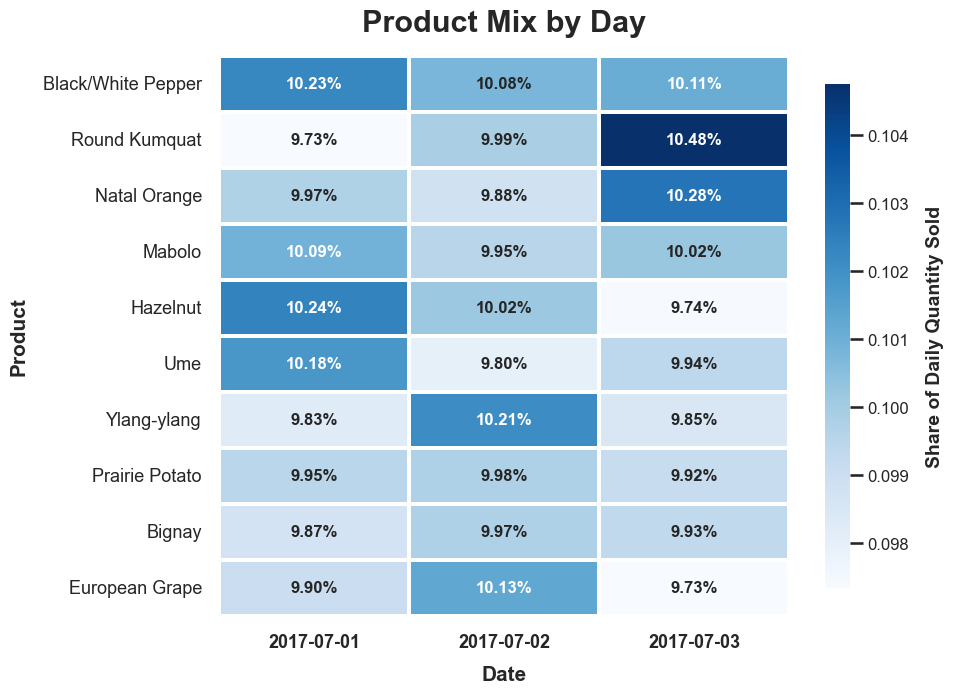

# Postie Data Challenge — Analysis Notes

This document presents my responses to the challenge questions, with the main evidence and reasoning included alongside each answer.

---

## Question 1: Why was the reported July 3 sales value lower than the previous day?

### Answer

The reported July 3 sales value appears low because it was calculated using the raw `2017-07-03.csv` source file rather than UTC-normalized transaction dates.

The reported value of `$164,065.00` is reproducible: it matches the total sales value in the raw July 3 source file exactly. However, after normalizing timestamps to UTC and grouping transactions by transaction date, July 3 sales total `$181,583.00`.

Under the UTC-normalized calculation, July 3 is only `$2,169.00` lower than July 2, a decrease of about `1.2%`, while transaction count actually increases. This suggests the original report overstated the size of the drop because the daily grouping method was inconsistent with the timestamp normalization used in this analysis.

### Date handling is the main issue

The key finding is that there are two ways someone could reasonably group the data by day, and they do not produce the same total.

| Definition | July 3 Sales | Difference from Reported |
|:---|---:|---:|
| Reported July 3 value | `$164,065` | `$0` |
| Raw source-file grouping | `$164,065` | `$0` |
| UTC-normalized transaction date | `$181,583` | `$17,518` |

The reported value is not arbitrary. It matches the `2017-07-03.csv` file total. The discrepancy comes from date assignment: grouping by file name and grouping by normalized transaction date do not produce the same daily sales value.

For the rest of the analysis, I use UTC-normalized transaction dates so daily comparisons share a consistent date boundary.

### Negative checkout values are unusual, but not the main explanation

July 3 also contains `17` negative checkout values. Each one is exactly `-$12.00`, for a total negative contribution of `-$204.00`.

These transactions are worth flagging because they appear only on July 3 and occur across both website IDs and both app versions. However, they do not explain the `$17,518` difference between the reported source-file total and the UTC-normalized daily total.

| Scenario | July 3 Sales |
|:---|---:|
| Keep `-12` values as valid negative revenue | `$181,583` |
| Exclude `-12` values as errors | `$181,787` |
| Treat `-12` values as sign errors | `$181,991` |

### Takeaway

The reported July 3 value appears lower than expected mainly because of date-boundary handling. The original number is reproducible, but it comes from grouping by the raw source file rather than by UTC-normalized transaction date.

The repeated `-$12` transactions are also worth investigating, but they are too small to explain the difference between the reported value and the UTC-normalized total. I would treat them as a separate data-quality/context question rather than the main reason for the reported sales drop.

---

## Question 2: What other metrics should the analyst report? Is average sales value the right metric?

### Answer

Average order value is useful, but it should not be reported by itself.

In this data, the median checkout value is stable at `$6.00` across all three days, while average order value changes more noticeably. That tells me the average is being influenced by the upper tail of the checkout distribution rather than reflecting a major shift in the typical transaction.

For a daily sales report, I would include total sales, transaction count, average order value, median order value, high-value transaction counts, negative/unusual checkout counts, and website/app-version breakdowns.

### Daily sales need more than one metric

The daily metrics tell a more complete story when viewed together.

| Date | Transactions | Total Sales | Avg Order Value | Median Order Value | Min Order | Max Order |
|:---|---:|---:|---:|---:|---:|---:|
| 2017-07-01 | 9,903 | `$223,515` | `$22.57` | `$6.00` | `$0` | `$55,084` |
| 2017-07-02 | 11,537 | `$183,752` | `$15.93` | `$6.00` | `$3` | `$55,002` |
| 2017-07-03 | 11,748 | `$181,583` | `$15.46` | `$6.00` | `-$12` | `$60,000` |

The median stays flat, but the average moves. That is a strong sign that average order value is being affected by unusually large transactions.

#### Daily Total Sales

#### Daily Transaction Count

#### Daily Average Checkout Value

#### Daily Median Checkout Value

### Metrics I would report

| Metric | Why I would report it |
|:---|:---|
| **Total sales** | Shows total revenue for the day. |
| **Transaction count** | Shows whether revenue changed because of purchase volume. |
| **Average order value** | Useful revenue-per-transaction metric, but sensitive to large transactions. |
| **Median order value** | Better representation of a typical checkout when the distribution is skewed. |
| **Min/max checkout value** | Quickly surfaces unusual negative or very large transactions. |
| **High-value transaction count and contribution** | Shows whether daily totals are being driven by a few unusually large checkouts. |
| **Negative checkout count and contribution** | Flags possible refunds, corrections, promotions, or logging issues. |
| **Website breakdown** | Helps determine whether a pattern is system-wide or isolated to one website. |
| **App-version breakdown** | Helps determine whether behavior changes around the app update. |

### Takeaway

Average order value should be included, but it should not be the primary metric by itself. A better daily report would pair average order value with total sales, transaction count, median order value, and anomaly checks.

---

## Question 3: What information can be extracted from the URLs? Can product prices be inferred?

### Answer

The URLs are useful because the query strings appear to encode the contents of each cart. From them, I can extract product names, quantities, cart size, product combinations, website/domain patterns, and malformed or unusual checkout behavior.

Product prices can be inferred for normal cart rows, especially from single-product transactions where the unit price is directly observable. These inferred prices appear stable across the normal transactions and consistent across both websites.

However, I would not infer prices blindly from every URL. At least one row parses as an `error` product and is associated with the extreme `$60,000.00` checkout amount. That row is useful as an anomaly flag, but I would not treat it as reliable product-price evidence.

### What the URLs contain

The URLs are not just page locations. The query strings appear to represent the cart contents.

Example patterns:

| URL pattern | Interpreted cart information |
|:---|:---|
| `...?Bignay=1` | 1 Bignay |
| `...?Ume=1&Natal+Orange=1` | 1 Ume + 1 Natal Orange |
| `...?Round+Kumquat=1&European+Grape=1` | 1 Round Kumquat + 1 European Grape |

This makes the URL field important because it provides transaction-level cart detail that is not available from `checkout_amount` alone.

### Product-price inference

Single-product carts are the cleanest starting point for price inference because the checkout amount can be divided directly by the item quantity:

`checkout_amount = quantity × unit_price`

For multi-product carts, the checkout amount is a combined total:

`checkout_amount = quantity_1 × price_1 + quantity_2 × price_2 + ...`

Because there are many normal single-product carts, the product prices can be checked directly before trying to reason about more complicated carts. Based on those clean rows, the inferred product prices appear stable and consistent across the two websites.

| Product | Inferred Unit Price |
|:---|---:|
| Prairie Potato | `$3` |
| Hazelnut | `$4` |
| Black/White Pepper | `$5` |
| European Grape | `$5` |
| Ylang-ylang | `$5` |
| Bignay | `$6` |
| Natal Orange | `$6` |
| Ume | `$6` |
| Round Kumquat | `$7` |
| Mabolo | `$8` |

### Important anomaly: malformed URL behavior

One transaction contains an error-like URL token and is associated with the largest checkout amount in the dataset:

| Timestamp | Website | App Version | Checkout Amount | Parsed Product | URL |
|:---|---:|---:|---:|:---|:---|
| 2017-07-03 07:59:32 UTC | 124 | 1.2 | `$60,000` | `error` | `http://xyz.com/checkout?Bignay=1&error=True` |

This matters because product price inference depends on the assumption that the URL accurately represents the cart. A row containing an error token should not be used as normal evidence for product pricing or typical checkout behavior.

### Other useful URL-derived fields

Beyond price inference, the parsed URLs are useful because they add structure to the transaction data. They make it possible to look at what was purchased, how many items were included, and whether certain cart patterns or malformed rows stand out.

| URL-derived field | Why it is useful |
|:---|:---|
| **Domain / website path** | Helps separate behavior across the two website implementations. |
| **Product names** | Allows product mix to be compared across dates, websites, and app versions. |
| **Product quantities** | Allows cart size and item-count behavior to be analyzed. |
| **Distinct products per cart** | Helps distinguish simple single-product purchases from larger multi-product carts. |
| **Malformed or error-like URL tokens** | Helps identify transactions that should be excluded from normal product-price inference. |
| **Product combinations** | Helps identify common bundles or cart patterns that may affect checkout value. |

### Takeaway

The URLs are one of the most useful fields in the dataset. They turn the transaction records into cart-level data, which makes product-price inference, cart-size analysis, product-mix analysis, and anomaly detection possible.

The main caution is that the URLs still need to be validated before being treated as reliable cart data. Normal product/count rows can be used for price inference, but malformed rows, error-like URL tokens, negative checkout values, and extreme checkout amounts should be handled separately.

## Question 4: Are there interesting purchasing combinations, events, or metrics worth reporting?

### Answer

Yes. The most useful things to report are a mix of purchasing behavior and data/system context.

The URL-derived cart fields make it possible to look at what customers are buying, how large their carts are, and whether certain products or product combinations stand out. From this view, most carts appear to be relatively simple, normal product prices appear stable, and the product mix is fairly balanced across the available dates.

That said, the purchasing patterns are only part of the story. Some of the most important findings come from how the data is recorded: timestamp/date-boundary handling, repeated `-$12` checkout amounts, the malformed URL tied to the `$60,000.00` checkout value, and the app version transition. These details affect how much confidence I would place in the raw sales totals and how I would explain changes over time.

### Purchasing behavior worth displaying

The URL-derived cart fields are helpful because they let us move beyond daily sales totals. Instead of only asking whether sales went up or down, we can also look at what people bought, how many items were in their carts, and whether certain products or combinations show up more often than others.

These are the purchasing views I would include:

| Area | What I would show | Why it matters |
|:---|:---|:---|
| **Cart size** | Distinct products per cart and total item quantity | Helps show whether purchases are mostly simple carts or larger/more complex orders. |
| **Common product combinations** | Most common multi-product carts | Gives a sense of normal bundle/cart behavior and helps explain larger checkout amounts. |
| **Product mix** | Daily product share and product-mix deviation | Shows whether changes in sales may be related to what customers are buying. |
| **Website/app-version breakdowns** | Sales and unusual values by website ID and app version | Helps separate general purchasing behavior from website- or app-specific patterns. |

### Product mix context

From the URLs, we can gain insight into which products are being purchased online.

The bar chart below shows product purchases across the days. Overall, each product appears to be purchased at a roughly similar rate. In other words, there does not appear to be one product that is overwhelmingly popular or one product that is clearly underperforming.

Because the product mix appears fairly balanced overall, we can use the heatmaps to check whether any products stand out more clearly on a day-to-day basis.

Together, these views help describe the general purchasing mix and make it easier to spot whether any products stand out across dates.

### Data and system context

Beyond the purchasing patterns, there are a few data/system details that change how I would interpret the results. These are not necessarily “bad data” issues, but they are places where the raw numbers can be misleading if they are treated too casually.

| Finding | Why it matters |
|:---|:---|
| **Date-boundary/source-file mismatch** | The originally reported July 3 value is reproducible, but it comes from source-file grouping. When timestamps are normalized to UTC and grouped by transaction date, the July 3 total is higher. This means daily sales comparisons depend on having a consistent date definition. |
| **Repeated `-$12` checkout amounts** | These transactions only appear on July 3, and they show up across both websites and both app versions. They may be valid adjustments, refunds, or promotions, but the repeated exact value makes them worth isolating before final revenue reporting. |
| **Malformed/error-like URL tied to `$60,000.00` checkout** | The `$60,000.00` transaction is especially important because the URL contains an error-like token. I would not use this row as normal evidence for product pricing or typical checkout behavior. |
| **App version transition on July 3** | July 3 includes both app version `1.1` and `1.2`. That does not prove the app update caused a problem, but it is useful context when checking whether unusual behavior lines up with the version change. |
| **Skewed checkout distribution** | A small number of very large transactions can noticeably affect total sales and average order value. This is why I compare averages with medians and inspect large checkout values directly. |

### Takeaway

The main thing I would be careful about is treating the daily sales totals as simple, clean numbers without checking how they were created.

Some of the most important findings come from the “boring” parts of the data: timestamp handling, source files, URL parsing, app versions, and unusual checkout values. These details do not necessarily mean the data is wrong, but they do affect how confidently I would explain changes in sales or use the data for forecasting.

For this reason, I would report the purchasing patterns alongside the data/system context. The product mix and cart behavior help explain what customers appear to be buying, while the timestamp, URL, and checkout anomalies help explain how much trust to place in the raw totals.

---

## Question 5: Can total sales for 2017-07-04 be predicted? How certain is the prediction?

### Answer

I predict July 4 total sales will be approximately **$182,500**, with an uncertainty range of roughly **$165,000 to $205,000**.

This is a low-confidence forecast. The estimate is based on simple baselines rather than a complex model because only three days of transaction data are available. The point estimate comes from the middle of several baseline calculations, including a prior-day forecast, a recent two-day average, a transaction-count/AOV forecast, and a small adjustment scenario for the repeated `-$12` checkout values.

The July 4 holiday adds extra uncertainty. Sales could plausibly be higher if customers are buying food-related products for gatherings, BBQs, or holiday events. Sales could also plausibly be lower if customers are busy with festivities, shopping in physical stores, or behaving differently from a normal weekday.

### Simple forecast baselines

These are not complicated estimation attempts. With only three days of data, a complicated model would likely give a false sense of confidence.

Instead, I used a few simple baselines to anchor the forecast near recently observed sales levels. Each method makes a slightly different assumption about what July 4 might look like.

| Method | Forecasted July 4 Sales | What it assumes |
|:---|---:|:---|
| Prior-day forecast | `$181,583` | July 4 looks like July 3. |
| Recent 2-day average | `$182,668` | July 4 looks like the average of July 2 and July 3. |
| Transaction count × recent AOV | `$182,684` | July 4 has similar transaction count and average order value as the recent period. |
| July 3 adjusted if `-12` values were sign errors | `$181,991` | July 3 would be slightly higher if repeated negative values were sign errors. |

### Why I used the middle of the baselines

The point forecast is the median of the simple baseline estimates. I used the median because each baseline captures a slightly different assumption, and I did not want one method to dominate the forecast.

The candidate estimates are all in the same general range, so I use approximately `$182,500` as the point forecast. I would not treat the exact dollar amount as precise.

### Why July 4 adds uncertainty

The forecast date is July 4, which may not behave like a normal day. The available data does not include prior holidays or enough surrounding dates to estimate a holiday effect directly.

There are plausible arguments in both directions. Since the products appear to be food-related, July 4 could increase purchasing if customers are preparing for gatherings, BBQs, or family events. On the other hand, online sales could decrease if customers are busy with holiday plans, away from work/computers, or more likely to make last-minute purchases in physical stores.

Because I cannot estimate that holiday effect from the available data, I do not apply a specific July 4 adjustment. Instead, I keep the point estimate close to the recent observed sales level and use a wider uncertainty range.

### Takeaway

The most defensible forecast here is a simple baseline estimate, not a highly tuned model.

I would use approximately **$182,500** as the July 4 point forecast, with a working range of **$165,000 to $205,000**. The point estimate is anchored to the recent normalized daily sales totals, but the range is intentionally wide because the dataset is short, July 4 may affect purchasing behavior, and the data includes transaction-level anomalies that should be interpreted carefully.

---

## Question 6: What additional information, data, or access would improve the prediction?

### Answer

Yes. The forecast would be substantially better with more historical transaction data, especially comparable weekdays and prior holiday periods. With only three days of data, I cannot reliably estimate normal day-to-day variation, holiday effects, seasonality, or whether July 4 should be adjusted upward or downward.

I would also want clearer reporting rules and system context: the correct timezone/date-boundary definition, product catalog/pricing data, promotion/refund information, and app release or error logs. These would help determine whether unusual values are real business behavior or data/system artifacts.

Without that additional context, the July 4 prediction should remain a simple, low-confidence baseline rather than a more complex forecast.

### Most useful additional data

| Additional data or access | Why it would improve the prediction |
|:---|:---|
| **More historical transaction data** | Needed to estimate normal day-to-day variation, weekday patterns, holiday effects, and seasonality. |
| **Prior July 4 / holiday sales history** | Would help estimate whether July 4 tends to increase or decrease online sales for these products. |
| **Confirmed timezone and reporting rules** | Daily totals depend on how transaction dates are defined, so the reporting timezone should be explicit. |
| **Product catalog and authoritative prices** | Would validate inferred product prices and help separate normal purchases from malformed URL behavior. |
| **Promotion, discount, refund, tax, and shipping fields** | Would clarify why checkout amount may differ from product quantity times price. |
| **App release and deployment logs** | July 3 includes an app version transition, so release timing and known issues could explain changes in behavior. |
| **Application error/logging data** | Would help explain malformed/error-like URL rows and determine whether extreme checkout values are valid. |
| **Order/session identifiers** | Would help detect duplicate orders, retries, replayed checkouts, abandoned sessions, or repeated customer behavior. |
| **Inventory or product availability data** | Would help determine whether product mix or sales volume changed due to stockouts or availability issues. |

### Why this matters

The largest limitation is the short time window. With only July 1 through July 3 available, it is not possible to reliably estimate trends, seasonality, weekday effects, or holiday behavior.

The second limitation is context. The analysis uncovered several values that could be valid business behavior or could be system/data issues. More data would not only improve the forecast; it would also make it clearer which observed patterns reflect customer behavior and which reflect reporting definitions, system behavior, or transaction anomalies.

---

## Final Note

The strongest finding is not that July 3 had a large sales drop. After normalizing timestamps, July 3 sales are close to July 2 sales. The bigger lesson is that daily sales reporting needs consistent date handling and should be paired with transaction-level checks.

For this dataset, I would be especially careful with:

- timezone/date-boundary definitions,
- repeated `-$12` checkout values,
- the `$60,000.00` checkout tied to `error=True`,
- the July 3 app-version transition,
- and the skewed checkout amount distribution.
